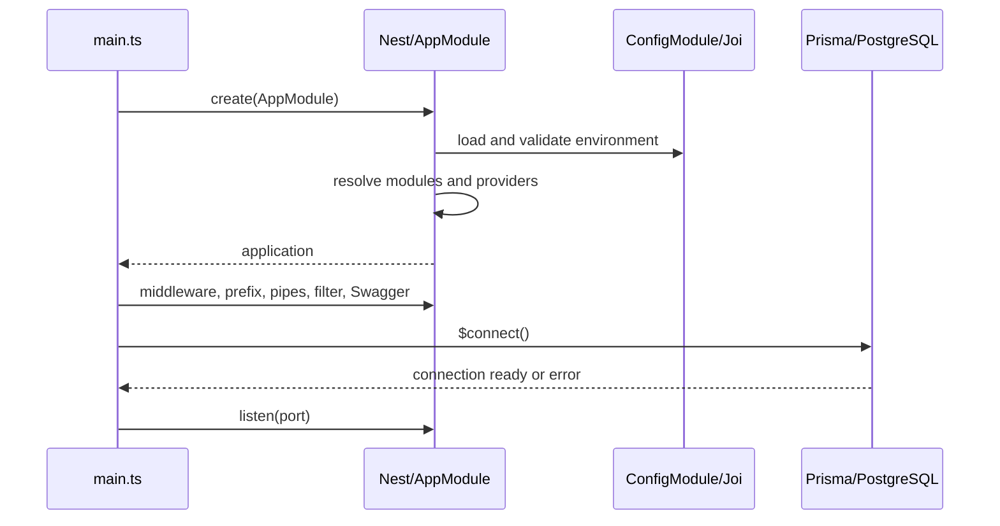

# 5. Bootstrap and configuration

[Home](README.md) · [Setup](02-project-setup.md) · [Lifecycle](07-request-lifecycle.md)

## Startup sequence

[main.ts](../src/main.ts) calls `bootstrap()` and awaits `NestFactory.create(AppModule)`. [AppModule](../src/app.module.ts) loads global configuration with Joi validation and imports each feature. Nest resolves providers, including Prisma's PostgreSQL adapter, the mail transporter, and JWT configuration/strategy. Required configuration is checked before requests can be served.

After application creation, bootstrap enables Nest shutdown hooks, installs Helmet and CORS, sets the literal prefix `api/v1`, installs a global transforming validation pipe and Prisma exception filter, creates Swagger documentation at `/docs`, obtains `PrismaService`, explicitly awaits `$connect()`, and listens on `Number(process.env.PORT ?? 3000)`. Startup logs display the API and documentation URLs.

An invalid environment prevents initialization; an unreachable database prevents reaching `listen`. A constructed SMTP transporter does not prove mail delivery works. No explicit top-level bootstrap catch or retry loop is supplied.

`app.enableShutdownHooks()` activates Nest lifecycle handling, but `PrismaService` has no `onModuleDestroy`/`onApplicationShutdown` disconnect hook. Its separate `enableShutdownHooks(app)` method registers `beforeExit`, yet main never calls that method. Do not describe graceful database draining as fully implemented.

## Environment reference

The template lists configuration names. Actual startup rules live in `AppModule`, runtime JWT settings in `AuthModule`, token lifetime in `AuthService`, mail settings in `MailService`, and database URL loading in `PrismaService`/`prisma.config.ts`.

| Variable | Required/default | Consumer and meaning |
| --- | --- | --- |
| `NODE_ENV` | Defaults `development`; development/test/production only | Config validation; Compose forwards it; Docker sets production unless overridden |
| `PORT` | Joi port; default 3000 | Main reads process environment with explicit fallback |
| `DATABASE_URL` | Required URI | Prisma adapter and CLI; Joi does not prove credentials or reachability |
| `JWT_SECRET` | Required, minimum 32 characters | Signing and verification |
| `JWT_EXPIRES_IN` | String, default `15m` | JWT signing options; Joi only checks string type, not duration grammar |
| `REFRESH_TOKEN_DAYS` | Runtime fallback 30 | AuthService converts to Number; absent from Joi schema and Compose API forwarding |
| `CORS_ORIGIN` | Required string | Main splits comma-separated values and trims each |
| `SMTP_HOST` | Required string | Nodemailer host |
| `SMTP_PORT` | Valid port, default 587 | Nodemailer port |
| `SMTP_USER` | Required string | SMTP authentication user |
| `SMTP_PASSWORD` | Required string | SMTP authentication secret |
| `EMAIL_FROM` | Required email | Outbound sender |
| `FRONTEND_URL` | Required URI | Base for verification/reset links |
| `POSTGRES_DB` | Needed for bundled Compose database | Database initialization; not part of Nest Joi schema |
| `POSTGRES_USER` | Needed for Compose | Database initialization and Compose API URL |
| `POSTGRES_PASSWORD` | Needed for Compose | Database initialization and Compose API URL |

ConfigModule uses default environment-file loading; no explicit environment-specific file selection is configured. Prisma CLI imports `dotenv/config` independently. Changing an environment file after process startup is not a hot secret-rotation system. `cache: true` here caches configuration access, not database query results or HTTP responses.

The CORS fallback `'*'` exists in main, but normal startup requires `CORS_ORIGIN`. Origins are browser origins including scheme and port. CORS is a browser access policy, not an authentication rule. `credentials: true` does not implement cookie-based login; this API sends tokens in JSON and reads bearer headers.

## Development and production

Development watch mode recompiles source. Production runs built output with externally supplied secrets. Both use the same routes, guards, validation, and Swagger setup. There is no conditional Swagger restriction or configured reverse proxy/TLS server.

The repository ignores local `.env`; documentation intentionally does not reproduce its values. A fixed development account password is present in seed/test material and the existing README; replace that provisioning approach for production. The presence of a template does not make any supplied credential safe to publish.

## Common mistakes

Do not assume Joi validates `REFRESH_TOKEN_DAYS`; malformed values can affect expiration calculations. Do not change `PORT` in Compose without also reviewing its fixed `3000:3000` mapping. Do not assume shutdown hooks automatically disconnect an arbitrary provider.

## What to remember

- Startup validation and database connection precede listening.
- Runtime configuration and Prisma CLI configuration are related but separate.
- SMTP availability is not included in the startup database check.
- A default in ConfigService does not mean every direct process.env read uses it.
- Compose forwarding determines which host variables reach the API container.

## Check your understanding

1. Why can the app start with valid SMTP strings yet fail to send mail?
2. Which refresh-token setting is missing from Compose forwarding?
3. What would you implement to guarantee explicit Prisma disconnection on shutdown?
