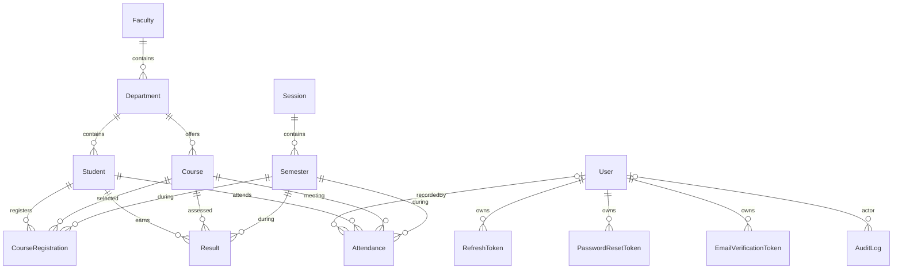

# 6. Database and data modeling

[Home](README.md) · [Feature studies](README.md#feature-studies) · [Technical debt](improvements-and-technical-debt.md)

## From objects to durable records

PostgreSQL stores tables, foreign keys, indexes, and constraints. Prisma generates a typed client from [schema.prisma](../prisma/schema.prisma). [PrismaService](../src/prisma/prisma.service.ts) extends that client and constructs `PrismaPg` with `DATABASE_URL`. Feature services receive the shared provider through dependency injection.

A call such as `prisma.user.findUnique({ where: { email } })` conceptually means:

```sql
SELECT * FROM "User" WHERE "email" = $1 LIMIT 1;
```

This is conceptual SQL, not a capture of Prisma's generated statement. Parameters separate data from query structure. `select` limits returned fields; `include` loads related records; `where` filters; `orderBy` sorts; `skip`/`take` implement offset pagination. Do not assume each include is exactly one SQL join without inspecting the query engine's actual execution.

## Relationships



Every activity row references a student, course, and semester. There is **no foreign key from Result or Attendance to CourseRegistration**. A database-valid result therefore need not represent an active registration. Optional audit/recorder links survive user deletion as null values.

## Models and fields

All 14 models have an `id` generated with Prisma `uuid()` and a `createdAt` default. Mutable core entities have `updatedAt @updatedAt`; token/audit rows do not. Prisma-managed defaults and update behavior should not be assumed to execute for arbitrary hand-written SQL.

| Model | Fields and purpose beyond common identity/timestamps | Key invariants and usage |
| --- | --- | --- |
| `User` | email, passwordHash, firstName, lastName, role, emailVerifiedAt?, failedLoginAttempts=0, lockedUntil?, isActive=true | Unique email; role defaults STAFF; Auth/Users own account behavior |
| `RefreshToken` | tokenHash, userId, expiresAt, revokedAt? | Unique hash; many sessions per user; revocation preserves row |
| `PasswordResetToken` | tokenHash, userId, expiresAt, usedAt? | Unique hash; records use of one reset link |
| `EmailVerificationToken` | tokenHash, userId, expiresAt, usedAt? | Unique hash; email ownership workflow |
| `AuditLog` | userId?, action, entity, entityId?, metadata? JSON, ipAddress?, userAgent? | Actor optional; target ID is a plain string, not a generic foreign key |
| `Student` | studentNumber, firstName, lastName, middleName?, email, phone?, dateOfBirth, gender, level, address?, status=ACTIVE, departmentId | Unique studentNumber and email; required department; no login identity |
| `Faculty` | name, code | Both individually unique; organizational parent |
| `Department` | name, code, facultyId | Globally unique code; name unique within faculty |
| `Course` | code, title, description?, creditUnits, level, semesterName, isElective=false, departmentId | Unique code; credits used when calculating GPA |
| `Session` | name, startDate, endDate, isCurrent=false | Unique name; groups semesters, e.g. an academic year |
| `Semester` | name, sessionId, startDate, endDate, isCurrent=false | Unique `(sessionId, name)`; FIRST or SECOND |
| `CourseRegistration` | studentId, courseId, semesterId, status=REGISTERED, registeredAt | Unique student/course/semester; DROPPED row retains unique key |
| `Result` | studentId, courseId, semesterId, caScore, examScore, totalScore, grade, gradePoint | Unique student/course/semester; numeric scores are Float fields |
| `Attendance` | studentId, courseId, semesterId, date, status, recordedById? | Unique `(studentId, courseId, date)`; semester is absent from this key |

Question marks mean nullable/optional schema fields. Dates are `DateTime`, including attendance `date`: the database key compares timestamps, not an abstract calendar day.

Enums constrain stored categories: `Role` ADMIN/STAFF; `Gender` MALE/FEMALE/OTHER; `StudentStatus` ACTIVE/INACTIVE/GRADUATED/SUSPENDED; `SemesterName` FIRST/SECOND; `RegistrationStatus` REGISTERED/DROPPED; `Grade` A–F; `AttendanceStatus` PRESENT/ABSENT/EXCUSED. Database enums do not automatically expose an HTTP update field. Student status exists and is filterable, but student create/update DTOs do not allow setting it.

### UUID values versus native UUID columns

A string containing a UUID is not necessarily a PostgreSQL UUID column. Most IDs are Prisma `String` without `@db.Uuid`, producing text storage in migrations. Faculty/Department IDs, Department.facultyId, and Course.departmentId declare native UUID storage.

**Observed discrepancy:** the last migration changes `Student.departmentId` to UUID, while the schema still declares plain `String` for that field. Generated types are strings in either case, so TypeScript does not reveal this difference. Treat the schema and applied migration history as potentially inconsistent; compare them on an isolated database before generating further migrations. This documentation does not repair the mismatch.

## Constraints and indexes solve different problems

A primary key uniquely identifies one row. A foreign key prevents a child from referencing an absent parent. A unique key prevents duplicates even when simultaneous requests pass the same application pre-check. An index accelerates some lookups but costs storage and write work.

User has email/role/isActive indexes. Token tables index userId and expiresAt and uniquely index tokenHash. Audit indexes userId, `(entity, entityId)`, action, and createdAt. Student indexes lastName, departmentId, status, gender, and createdAt. Faculty indexes name; Department indexes facultyId; Course indexes departmentId, level, semesterName. Session/Semester index current flags, and Semester also indexes sessionId. Registration indexes student/course/semester/status; Result indexes student/course/semester; Attendance indexes student/course/semester/date.

Some nonunique indexes duplicate a unique index's leading key, such as User.email. Assess actual query plans before removing or adding indexes. Case-insensitive substring searches are not guaranteed fast by a normal last-name index. An index on `isCurrent` is not a constraint that only one row is current.

## Delete behavior

| Parent deletion | Database consequence in migrations/schema |
| --- | --- |
| User | Cascade token rows; set AuditLog.userId and Attendance.recordedById null |
| Student | Cascade registrations, results, attendance |
| Session | Cascade semesters, subject to restrictions from their dependent activity |
| Faculty with departments | Restrict deletion |
| Department with students/courses | Restrict deletion |
| Course or Semester with registrations/results/attendance | Restrict deletion |

Deleting a student is destructive academic-history deletion, not soft deletion. Service `findOne` checks improve error messages but do not replace foreign keys or prevent concurrent changes between read and delete. P2003 currently maps to a generic 400 message, including deletion restrictions where “related record does not exist” can be misleading.

## Migration history as a learning case study

1. [Initial migration](../prisma/migrations/20260904192142_init/migration.sql): User/Student tables; student department is initially text.
2. [Security models](../prisma/migrations/20260908192410_added_new_models/migration.sql): tokens, audit, account state, indexes and user relations.
3. [Academics](../prisma/migrations/20260911172215_academics/migration.sql): creates normalized faculty/departments; adds nullable departmentId; backfills matching legacy names; explicitly raises if any student cannot be mapped; only then drops legacy text and requires the new key. It also introduces the academic activity/calendar schema. Read the SQL, not just the generated warning header, which does not describe the later manual backfill logic fully.
4. [Academic UUID conversion](../prisma/migrations/20260912100000_academic_ids_uuid/migration.sql): drops relevant foreign keys, maps known legacy identifiers to deterministic UUIDs, casts columns, and restores constraints. Unknown non-UUID identifiers can fail casting. Verify existing data before applying this upgrade.

This illustrates **expand, backfill, contract**: introduce a replacement representation, migrate data, then remove the old one. The repository does not prove that these migrations were deployed anywhere. Applied SQL files should not be casually rewritten; use a follow-up migration for changes already shared/deployed.

[seed.ts](../prisma/seed.ts) uses upserts with empty update objects for the administrator/faculty/departments and `createMany(skipDuplicates)` for students. This avoids duplicate fixture creation but does not reconcile edited fixture data. It is not wrapped in one transaction, so partial seed progress can persist. Direct seed inserts bypass HTTP DTO validation.

## Transactions and concurrency

Reset/change-password group password updates and refresh revocation into `$transaction([...])`. Email verification groups user/ticket updates. Session/semester `setCurrent` uses an interactive transaction to unset old flags and set the selected row. Student/audit list operations group row retrieval and count in array transactions; UsersService instead uses `Promise.all`.

Atomicity means a transaction's writes commit or roll back together. It does not mean every pre-read is inside the transaction, or that concurrent calls cannot violate application assumptions. Token validity checks precede writes, refresh rotation is not transactional, and current-period uniqueness has no database constraint. List/count operations without an explicitly stronger isolation policy are not a promise of a stable snapshot under all concurrent changes.

## What to remember

- Schema, migration SQL, generated client, and actual database are distinct artifacts.
- Foreign keys guarantee existence, not complete academic policy.
- Unique constraints protect against concurrent duplicate inserts.
- Cascades can erase history; restrict constraints can block deletes.
- Transaction scope and isolation determine the guarantees you actually obtain.

## Check your understanding

1. Why can dropping a registration still prevent re-registering the same tuple?
2. Why can changing a course's credit units change old GPA calculations?
3. What does the database do to attendance when its recorder is deleted?
4. Why is a UUID-looking TypeScript string insufficient evidence of its database type?
