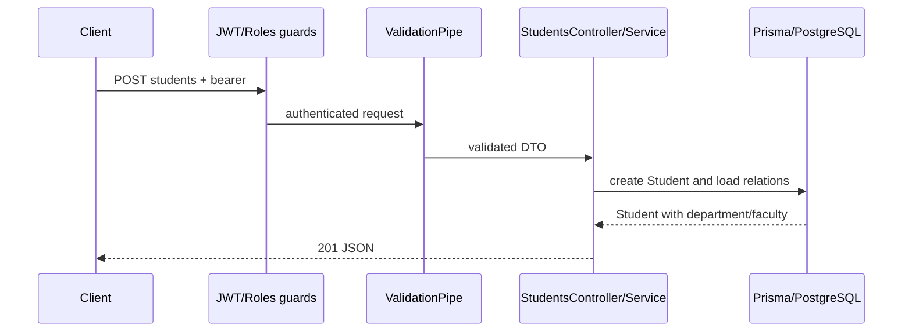

# 11. End-to-end data flows

[Home](README.md) · [Lifecycle](07-request-lifecycle.md) · [API](10-api-reference.md)

Examples use placeholders for secrets/IDs. These are explanatory walkthroughs, not evidence that the requests were executed. All paths include `/api/v1`.

## A. Register, verify, and log in

Client POSTs `/auth/register` with email/names/password. No JWT/role guard runs; RegisterDto validates. AuthController delegates to AuthService, which checks lowercase email, bcrypt-hashes the password, inserts a STAFF User, stores a hashed verification token, awaits MailService, records audit, and returns public user fields with 201. SMTP delivers a link to the frontend; frontend submits `{token}` to `/auth/verify-email`. VerifyEmailDto checks string input, service checks hash/use/expiry, and a transaction updates User and token; audit follows, then a message with 201.

Client POSTs `/auth/login` with email/password. LoginDto runs, the service checks lock/password/active status, clears counters, signs JWT, stores hashed refresh token, and audits with request context. Response is 201 `{accessToken,refreshToken,user}`. Neither login nor JWT validation checks emailVerifiedAt.

```mermaid
sequenceDiagram
  participant C as Client/frontend
  participant A as AuthController/AuthService
  participant D as PostgreSQL via Prisma
  participant M as MailService/SMTP
  C->>A: POST register (validated body)
  A->>D: lookup email; create User
  A->>D: store verification token hash
  A->>M: await verification email
  M-->>C: frontend verification link
  A->>D: insert audit
  A-->>C: 201 public User
  C->>A: POST verify-email with raw token
  A->>D: lookup hash; transaction marks verified/used
  A->>D: insert audit
  A-->>C: 201 message
```

If SMTP rejects its operation, later audit/response steps are skipped while earlier inserts persist. A transaction cannot roll back an already-sent external email; a future outbox design must coordinate durable intent with delivery.

## B. Create and update a student

Request body for POST `/students`:

```json
{
  "studentNumber":"DEMO-1001",
  "firstName":"Demo",
  "lastName":"Learner",
  "email":"learner@example.invalid",
  "dateOfBirth":"2004-05-20",
  "gender":"OTHER",
  "departmentId":"<existing-department-uuid>",
  "level":100
}
```

JWT establishes identity; RolesGuard has no create restriction. After replacing the UUID placeholder, CreateStudentDto validates input. The service lowercases email, converts birth date, inserts, and includes department/faculty. Database enforces uniqueness and relation existence. No audit/email occurs; response is 201 Student with relations.

For PATCH `/students/<student-uuid>` with `{"level":200}`, guards and UUID pipe run, UpdateStudentDto validates, service checks existence, updates only supplied fields, and returns 200 with department. The DB updatedAt changes through Prisma. Missing student gives 404; adding `status` produces validation 400 because it is not in this DTO.



## C. Registration → result → GPA

Create the Faculty/Department/Course and Session/Semester as an administrator first, or select existing records. Authenticate and POST `/academic/registrations` with studentId/courseId/semesterId. Three UUID validators run; RegistrationsService inserts a REGISTERED row and returns related student/course/calendar details, 201. There is no additional registration policy check or audit.

POST `/academic/results` with those IDs, `caScore:25`, `examScore:50`. ADMIN/STAFF role metadata is enforced; DTO verifies numeric bounds. ResultsService calls computeGrade: total 75, A, gradePoint 5. Prisma inserts the tuple; duplicates return 409. Although this walkthrough registers first, the result service does not enforce registration.

GET `/academic/students/<student-uuid>/gpa?semesterId=<semester-uuid>` verifies bearer and UUIDs, checks student existence, reads result rows with course credits, and reduces weighted points. One three-credit A produces `{gpa:5,totalCreditUnits:3,...}` with 200 and a course breakdown. This read has no writes or audit/email side effects. It uses current course credits, so subsequent catalog changes can alter output.

PATCH `/academic/results/<result-uuid>` with both scores recomputes grade; PATCH with only examScore is invalid. Dropping the registration later does not remove the stored result or exclude it from GPA.

## D. Refresh and logout

POST `/auth/refresh` with `{refreshToken:"<raw-token>"}` → RefreshTokenDto string validation → SHA-256 lookup with User → reject missing/revoked/expired row → revoke old row → sign access token/store new refresh hash → audit → 201 token pair. No access bearer is required, because possession of the refresh secret is the credential.

POST `/auth/logout` with the same body and a valid access bearer → JwtAuthGuard creates req.user → service revokes matching user-owned refresh hash → audit → 201 message. If you already rotated the token, logging out the old value does not revoke the new one. Neither operation revokes an existing access JWT.

## E. Recover a password

POST `/auth/forgot-password` with email → email validation, no bearer → optional user lookup branch → create hashed 15-minute token → SMTP reset link → audit → generic 201 message. Missing user skips writes/email but gives the same normal message.

POST `/auth/reset-password` with token/newPassword → password DTO → lookup and validity check → bcrypt → transaction updates password, marks that token used, revokes active refresh rows → audit → 201 message. The token check occurs before the transaction, so atomic token consumption remains an improvement. Other reset links/access tokens are not invalidated.

## F. Delete a student and understand the side effects

ADMIN DELETE `/students/<uuid>` → signature/role checks → UUID pipe → service findOne → delete → database cascades registrations/results/attendance → 200 message. STAFF receives 403 before deletion. The service does not add an audit record. Deleting this row removes the inputs used by GPA and attendance summaries; those endpoints subsequently return student-not-found.

## What to remember

- A request crosses independent transport, policy, service, and database boundaries.
- Identity email is awaited in the request, not queued.
- Relation constraints are not a substitute for registration policy.
- A transaction covers only its enclosed database work.
- Side effects can persist despite an error returned later.

## Check your understanding

1. At which step can register fail after the User exists?
2. Why does the example register before posting a result even though the service does not require it?
3. Which delete side effects are implemented by PostgreSQL rather than TypeScript loops?
