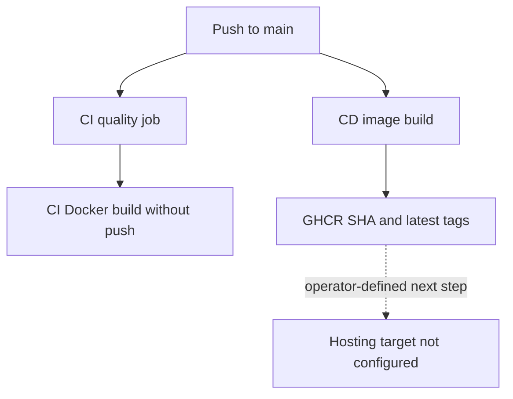

# 15. CI/CD, deployment, and production readiness

[Home](README.md) · [Docker](14-docker.md) · [Technical debt](improvements-and-technical-debt.md)

## CI: checked code and a buildable image

[ci.yml](../.github/workflows/ci.yml) runs for pushes and pull requests targeting main/develop. It has read-only contents permission. The `quality` job uses ubuntu-latest and a PostgreSQL 17 service with a healthcheck and host port 5432. Its environment provides a disposable test database URL, test JWT settings, CORS, and required SMTP/frontend placeholders. There is no SMTP service container.

The steps check out code, select Node 24 with npm caching, install using `npm ci --legacy-peer-deps`, generate Prisma, deploy migrations, seed, lint, run unit tests, run E2E tests, then build. A failure normally stops later steps and fails that job. The `docker` job has `needs: quality`, so it only builds its image after quality succeeds. It uses Docker build-push-action with `push:false`, tag `student-management-api:ci`; it is a build check, not publication. No uploaded test/coverage artifact or enforced coverage threshold is configured.

A workflow is an event-triggered file; a job runs on a runner; steps run commands/actions within the job. Service containers provide dependencies such as PostgreSQL. `needs` creates a job dependency **inside this workflow**. It does not connect independent workflows automatically.

## CD: publication, not host deployment

[cd.yml](../.github/workflows/cd.yml) runs on pushes to main on ubuntu-latest. It grants contents read and packages write, logs into GHCR with the workflow GITHUB_TOKEN, sets up Buildx, generates SHA and default-branch latest metadata tags, and builds/pushes using GitHub Actions build caching.

It publishes to `ghcr.io/${github.repository}`. No SSH, cloud deployment, Kubernetes manifest, host replacement, smoke test, or rollback step follows. It does not declare a dependency on CI success; both workflows can run independently for the same push. Any branch-protection requirements outside the repository are unknown.

The dashed final edge is a missing operational step, not existing automation. `npm run deploy` maps to `nest deploy`, but the repository does not establish a configured target for it.

## A deployment procedure you would need to define

The following is a proposed operator workflow, **not an existing deployment pipeline**:

1. Select a tested immutable image identifier and hosting environment; avoid assuming latest identifies a validated release.
2. Provision PostgreSQL and SMTP access, production secrets, network policies, and frontend origins/links. Do not seed production with development accounts.
3. Review migrations against a restored representative database, including UUID/schema consistency and data backfills. Take/verify a restorable backup appropriate to the change.
4. Coordinate migration application once and deploy the compatible application version. Current image CMD migrates at each startup, so multi-replica deployment needs deliberate handling.
5. Configure domain/TLS termination and proxy behavior, then verify health plus authenticated smoke requests through the real ingress.
6. Observe error rates and resource behavior; retain the prior image and a tested data recovery strategy.

Redeploying an old image does not reverse a schema migration. Prefer backward-compatible schema expansion followed by cleanup in later releases. Restoring a database can lose writes since the recovery point and is not a casual rollback button. No backup or reverse migration procedure is implemented here.

## Production readiness by evidence

| Category | Implemented | Partial/missing and consequence |
| --- | --- | --- |
| Identity | Hashing, expiry, refresh storage, role guard, lockout | Public STAFF signup; stale JWT claims; non-atomic token consumption |
| Input integrity | DTOs, unique/FK constraints, selected transactions | Raw audit queries, boolean coercion, incomplete domain policies |
| Networking | CORS, Helmet, Compose networking | No TLS/reverse-proxy policy; database port published |
| Health | Database Terminus endpoint; PostgreSQL Compose healthcheck | No separate liveness/readiness, SMTP probe, API container healthcheck |
| Shutdown | Nest shutdown hooks enabled | No explicit Prisma disconnect hook; shell startup signal behavior unverified |
| Observability | Startup/framework logs and selected audit events | No structured request logs, metrics/traces/alerts or retention policy |
| Resilience | Restart policy; relational transactions | No application retries/timeouts/outbox; SMTP in request path |
| Delivery | CI checks and registry publication | No explicit CI-to-CD gate, host rollout, smoke check, or rollback automation |
| Data recovery | Persistent local volume | No backup schedules, restore drills, or disaster recovery objectives |
| Scale | Shared database with modular stateless HTTP handlers | Pool budgets, distributed throttle, unbounded lists, token/current-period races |

“Stateless HTTP handlers” does not mean no state: refresh tokens, audits, lockouts, and records live in PostgreSQL. Scaling processes must preserve those semantics. No production traffic measurements establish current capacity.

## What to remember

- CI Docker build and CD Docker publication are distinct jobs in independent workflows.
- A published image is not a deployed service.
- Migration compatibility is part of rollback planning.
- Health success is necessary but insufficient release validation.
- Readiness requires concrete operational controls, not a Swagger description.

## Check your understanding

1. Can CD publish while the separate CI workflow fails?
2. Which secret authenticates the registry push?
3. Why is a named Docker volume not a backup strategy?
