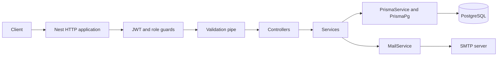

# Student Management API: a guided codebase study

This book explains the repository as inspected on 2026-09-18. It connects implementation, engineering concepts, runtime behavior, and operational limitations. Source files are the authority; inferred rationale and proposed improvements are identified explicitly. The existing [project README](../README.md) remains a quick-start companion.

The application lets staff manage student records and academic administration: faculties, departments, courses, sessions, semesters, registrations, results, GPA, and attendance. Administrators also manage staff accounts. Students are records, not login accounts.

## Technology stack

| Area | Repository technology | Purpose |
| --- | --- | --- |
| Runtime | Node.js 24 in CI and Docker | Executes compiled JavaScript |
| Language | TypeScript 6; ES modules | Static checking and application code |
| HTTP framework | NestJS 12, Express adapter | Modules, dependency injection, routing, guards, pipes |
| Persistence | PostgreSQL 17 in Compose/CI; Prisma 7; PrismaPg/pg | Relational storage and typed queries |
| Identity | Passport JWT, Nest JWT, bcrypt, Node crypto | Access tokens, password verification, opaque tokens |
| Validation | class-validator, class-transformer, Joi | Request validation and startup configuration |
| API tooling | Nest Swagger | Interactive `/docs` UI |
| Email | Nodemailer and SMTP | Verification and password-reset links |
| Health/security | Terminus, Helmet; configured Throttler module | Database checks, HTTP headers; throttling enforcement is missing |
| Tests/tooling | Vitest, Supertest, Nest testing, Oxlint, Prettier | Tests, HTTP assertions, linting, formatting |
| Delivery | Docker, Compose, GitHub Actions, GHCR | Local services, quality checks, image publication |

Versions above describe repository declarations/configuration, not claims about the latest releases. `package-lock.json` pins the installation graph.

## Architecture in one minute

This is a modular monolith: one Nest process, multiple feature modules, one relational database. Controllers handle HTTP, services implement use cases, and services call the shared Prisma client directly. There is no separate custom repository layer. Authentication and user services also call audit and email services. No frontend, worker service, cache server, or message broker is implemented.

The graph shows application dependencies and the protected request path. Public authentication and health routes do not use JWT guards. See [Architecture](04-architecture.md) for startup wiring.

## Documentation map

### Foundations and runtime

1. [Project overview](01-project-overview.md)
2. [Project setup and commands](02-project-setup.md)
3. [Folder structure and dependencies](03-folder-structure.md)
4. [Architecture, NestJS, and TypeScript](04-architecture.md)
5. [Application bootstrap and configuration](05-bootstrap-and-configuration.md)
6. [Database and data modeling](06-database-and-data-modeling.md)
7. [Request lifecycle, validation, and errors](07-request-lifecycle.md)
8. [Authentication](08-authentication.md)
9. [Authorization and security](09-authorization-and-security.md)
10. [API reference and design](10-api-reference.md)
11. [End-to-end data flows](11-data-flow-examples.md)

### Feature studies

- [User administration](features/users.md)
- [Student records](features/students.md)
- [Faculties](features/faculties.md)
- [Departments](features/departments.md)
- [Courses](features/courses.md)
- [Academic sessions](features/sessions.md)
- [Semesters](features/semesters.md)
- [Course registration](features/registrations.md)
- [Results and grading](features/results.md)
- [GPA and CGPA](features/gpa.md)
- [Attendance](features/attendance.md)
- [Audit logging and health](features/audit-and-health.md)

### Engineering and operations

- [Testing](12-testing.md)
- [Email, observability, and performance](13-integrations-and-performance.md)
- [Docker and containers](14-docker.md)
- [CI/CD, deployment, and production readiness](15-delivery-and-production.md)
- [Development workflows and debugging](16-development-and-debugging.md)
- [Improvements and technical debt](improvements-and-technical-debt.md)
- [Recreating the project and learning roadmap](learning-roadmap.md)
- [Glossary](glossary.md)
- [Quick reference](reference.md)

## Recommended study order

Read chapters 1–7 first. Follow a student request through its feature chapter and chapter 11. Study authentication and authorization together, then the academic feature chapters in the order shown above. Finish with tests, email/performance, Docker, delivery, and development workflows. Use the roadmap's exercises to rebuild a smaller version yourself.

Each major lesson includes common mistakes, takeaways, or questions. Read the linked source alongside the explanation; do not interpret a proposed improvement as an existing feature. This documentation changes no application behavior.
